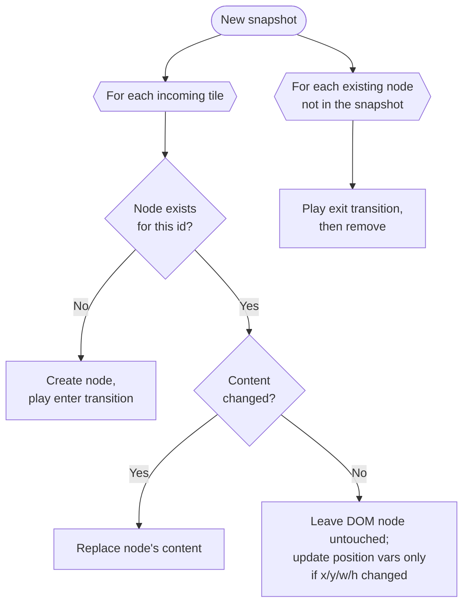

# SuperScreen — Frontend Design

The display page that runs fullscreen in a Chromium kiosk on the Pi. See
[`README.md`](README.md) for the overview and shared domain model, and
[`BACKEND.md`](BACKEND.md) for the API it talks to.

Status: **draft** · Last updated: 2026-06-02

---

## 1. Role & guiding principle

The display is a **dumb, resilient renderer**. All truth lives on the backend;
the page only reflects the latest snapshot and, critically, **never makes the
screen worse during a hiccup**. A 24/7 wall display must degrade gracefully, not
flash errors or blank out.

## 2. No build step

Plain **HTML/CSS/JavaScript, loaded as ES modules — no bundler, no framework**.
The backend already serves these files; there is nothing to compile on the Pi and
nothing to break on a toolchain mismatch. The render logic is small enough that a
framework earns nothing.

Upgrade path if it ever grows complex: a single-file `lit`/`preact` via ESM
import — still no build. Not the starting point.

## 3. Layout: CSS Grid driven by config

The page is one grid sized from the `grid` block in the layout response
(`cols`, `rows`, `gap`). Each tile maps directly onto grid coordinates via
`grid-column: x / span w` and `grid-row: y / span h` (1-based in CSS, so
`position.x + 1`). Text scales to the TV with viewport/`clamp()` units so it's
legible from across a room; media uses `object-fit: cover`.

## 4. Keyed reconciliation (the critical part)

This is the design decision that makes the difference between a smooth wall
display and a broken-looking one.

**Do not rebuild the DOM on each update.** A naive `innerHTML` rewrite would
restart every video and reload every iframe even when an unrelated tile changed.

Instead, diff the incoming snapshot against the live DOM **keyed by `tile.id`**:



Key property: an **unchanged tile's DOM node is never touched**, so a playing
video keeps playing and an iframe never reloads across polls. "Changed vs. not"
is decided by hashing each tile's content (or a per-tile version from the
backend). This is what lets the single-snapshot model (see overview) update one
expiring tile without disturbing the rest.

## 5. Content renderers (server-side Twig)

Content markup is rendered **server-side**, one Twig template per content type in
`templates/tile/<type>.html.twig` (`App\Service\Display\TileRenderer`). The layout
response carries the rendered HTML per tile (`tile.html`), and the display simply
injects it into a `.tile-content` wrapper — there is no per-type logic in JS.

| type     | template output                               | notes                              |
|----------|-----------------------------------------------|------------------------------------|
| `text`   | `<div class="text">`                          | **auto-escaped** by Twig           |
| `image`  | ``                                       | `object-fit` from optional `fit` (default cover) |
| `video`  | `<video muted autoplay loop playsinline>`     | muted is mandatory for autoplay    |
| `iframe` | `<iframe sandbox>`                            | some sites refuse to embed         |
| `html`   | sandboxed `<iframe srcdoc>` (`allow-scripts`)  | markup/JS isolated to the tile's own opaque-origin frame; `src` accepted as a fallback |

Adding a type is one new template. Because `ContentType` is a closed enum
(validated on write), there's no "unknown type" to handle at render time.

## 6. Polling loop & resilience

```
every poll_interval (~3s):
  GET /api/layout with If-None-Match: <lastEtag>
  304               -> do nothing
  200               -> store etag, reconcile
  network error/5xx -> KEEP current layout, retry next tick
```

Resilience rules:

- **Never blank the screen on a failed or empty poll.** Hold the last good
  layout. Stale content beats a white error page on a wall.
- **Recover on reload.** On load it just fetches `/api/layout`; since state is
  server-side, a reboot or the nightly reload restores the exact screen with no
  client-side persistence.
- **Optional "stale" indicator** (a subtle corner marker) if polls have been
  failing for more than N minutes — visible to an operator, ignorable to viewers.
  Off by default.

## 7. Memory & long-running stability

A browser left running for weeks slowly leaks. Counter it with a **scheduled
nightly page reload**; because state is server-side (§6), the reload is seamless.

## 8. Per-tile controls (operator affordances)

Each tile carries three small circular corner buttons (top-left): a **delete ×**
(`DELETE /api/tiles/{id}`), the **timeout pie / ∞** indicator, and a **drag
handle** (grip dots). Dragging the handle snaps the tile cell-to-cell (live
preview via the CSS grid vars) and commits on drop via
`PATCH /api/tiles/{id}/position`; tiles it lands on are evicted to the queue
server-side. **Polling is paused during a drag** so reconcile can't fight it, then
resumes (the server is authoritative). These are management affordances for an
operator on a browser — not really meant for the touch-free wall display.

When the write API is **key-protected**, these buttons send an `X-Api-Key` from
`localStorage` (`superscreenKey`), kept out of the page source so the public
kiosk never carries it. If a write is rejected (`401`) the page **prompts** for a
key, stores it, and retries — so it only asks when auth is actually on (in open
mode writes just succeed). Reads (the poll) never need a key.

## 9. Transitions

Tile enter/exit via a CSS class + `transitionend`, kept short (~150–300 ms fade).
Position changes on a surviving tile animate "for free" since grid placement is
animatable. Keep this minimal — flashy transitions on a 24/7 display get tiring
and risk leaving half-faded nodes if mistimed.

## 10. Frontend-specific open items

- Empty/default cell appearance (nothing, background, or fallback tile).
- Whether transitions are wanted at all, and their style.
- Whether the "stale" indicator should ship in v1.
