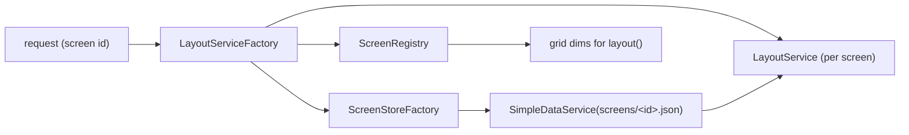

# SuperScreen — Multi-screen support

How SuperScreen grows from a single hard-wired screen to **multiple independent
screens**, each with its own grid, tiles, queue and reservations. See
[`README.md`](README.md) for the overview, [`BACKEND.md`](BACKEND.md) for the
current API, and [`FRONTEND.md`](FRONTEND.md) for the display.

Status: **implemented** (steps 1–4; step 5 optional items pending) · Last updated: 2026-06-18

---

## 1. Goal & decisions

Today there is exactly one screen: a single `state.json`, global grid config, and
the routes `/api/tiles`, `/api/layout`, `/`. We want any number of named screens
(e.g. `main`, `lobby`, `kitchen`), each fully isolated.

Decisions taken up front:

- **Per-screen grid.** Each screen owns its `cols` / `rows` / `gap` (and a display
  name), so different TVs/orientations are possible. The global `app.grid.*`
  config becomes the *default* applied to new screens.
- **Backward-compatible routing.** The existing `/api/tiles`, `/api/layout` and
  `/` keep working as the `main` screen; new `/api/screens/{screen}/…` and
  `/screens/{screen}` cover the rest. No change required to current callers.
- **Auto-create on first write.** Posting to an unknown screen creates it with the
  default grid, then places the tile. (A management API/console can set the grid.)
- **Storage: one file per screen** plus a small registry — see §3.
- **API keys stay global** for now (any key may write any screen); per-screen keys
  are a clean later addition (§10).

## 2. Domain model

A new value object:

```
App\Screen\Screen   (readonly)
  id    string   slug, validated (see §8)
  name  string   human label
  cols  int
  rows  int
  gap   int
```

The internal `Tile` model is unchanged — tiles simply live in a screen-scoped
store. There is no `screenId` on the tile; the *store it lives in* is the scope.

## 3. Storage layout

```
var/data/
  screens.json              # registry: id -> { name, cols, rows, gap }
  screens/
    main.json               # = today's state.json, migrated (§7)
    lobby.json              # tile.* / queue.* / reserve.*  (shape unchanged)
    kitchen.json
  keys.json                 # API keys — global, unchanged
```

**Why one file per screen** (rather than namespacing keys in a single file):

- Each request (a display polling its own screen, a write targeting one screen)
  loads only that screen's store — `SimpleDataService` reads the whole file into
  memory, so this keeps reads cheap as screens multiply.
- Per-screen ETag and "delete a screen" fall out naturally (hash / remove one file).
- The existing `TileRepository`, `QueueRepository`, `ReservationRepository` and
  their key prefixes (`tile.` / `queue.` / `reserve.`) **don't change at all** —
  only *which file* the underlying `SimpleDataService` points at.

Trade-off: the single-file alternative is less code to wire but threads a `screen`
argument through every repository method and loses the isolation above.

## 4. Backend architecture

The one structural change: per-screen services become **factory-built** instead of
autowired singletons, so all existing logic is reused verbatim against a
screen-specific store.

- **`ScreenRegistry`** (over `screens.json`): `all()`, `get(id): ?Screen`,
  `getOrCreate(id): Screen` (auto-create with the default grid), `save(Screen)`,
  `delete(id)`. Owns id validation (§8) and the screen-count cap.
- **`ScreenStoreFactory`**: `forScreen(id): SimpleDataService` bound to
  `var/data/screens/<id>.json`, memoised per request. Replaces today's
  fixed-path autowired `SimpleDataService`; `main` resolves to `screens/main.json`.
- **`LayoutServiceFactory`**: `forScreen(Screen): LayoutService` — builds the three
  repositories over that screen's store and a `TilePlacer` sized to the screen's
  grid. Limits stay global params. **`LayoutService` itself is unchanged.**

**Request wiring.** Controllers don't call the factory themselves. A
`kernel.request` subscriber (`ScreenContextSubscriber`, priority 7 — after the
router) reads the `{screen}` route param for the tile/layout actions, applies the
create-vs-404 policy (writes + `main` create; other reads 404), and stashes the
resolved `Screen` + its `LayoutService` in the **request attributes**
(`_screen` / `_layout`). A `ValueResolver` (`ScreenValueResolver`, high priority so
it beats the default service resolver) then injects them into the action's
`LayoutService $layout` / `Screen $screen` arguments. Request attributes are
request-scoped, so nothing leaks between requests; the console commands keep using
`ScreenRegistry`/`LayoutServiceFactory` directly (no request → the subscriber
doesn't fire). `ScreenApiController` (management) and `DisplayController` resolve
screens on their own and are not touched by the subscriber.



## 5. API & routing

Each existing action gains a second `#[Route]`; the unscoped one defaults
`{screen}` to `main`, so there's a single handler per action:

```php
#[Route('/tiles', defaults: ['screen' => 'main'], methods: ['POST'])]
#[Route('/screens/{screen}/tiles', methods: ['POST'])]
public function upsert(string $screen, LayoutServiceFactory $factory, ...): JsonResponse
{
    $layout = $factory->forScreen($screen); // getOrCreate
    ...
}
```

Same for `…/tiles/{id}/position`, `…/tiles/{id}/reservation`, `…/tiles/{id}` and
`…/layout`. `GET …/layout` reports **the screen's** grid from the registry instead
of the global params; ETag / `Cache-Control: no-store` are already per-response, so
they become per-screen automatically.

New management endpoints (writes, key-protected like the rest):

| Method & path                       | Purpose                               |
|-------------------------------------|---------------------------------------|
| `GET /api/screens`                  | List screens (id, name, grid).        |
| `POST /api/screens`                 | Create / set a screen's name + grid.  |
| `PATCH /api/screens/{screen}`       | Update name / grid dims.              |
| `DELETE /api/screens/{screen}`      | Remove a screen (file + registry).    |

`DELETE` refuses `main` (or requires `?force=1`).

## 6. Display (frontend essentially untouched)

- `DisplayController` adds `GET /screens/{screen}` next to `GET /` (default `main`),
  passing the screen id to the template.
- The template injects `window.SUPERSCREEN.layoutUrl` for that screen
  (`path('api_screen_layout', { screen })`, or `api_layout` for default).
- **No `app.js`/module logic changes.** The JS already derives everything from
  `layoutUrl` (`tilesUrl = layoutUrl.replace(/layout$/, 'tiles')`, and every write
  URL builds off `tilesUrl`), so `/api/screens/lobby/layout` ⇒ writes go to
  `/api/screens/lobby/tiles/…` with no edits.
- Optional: a `GET /screens` index page listing screens with links.

## 7. Migration & deploy

- **Lazy migration** in `ScreenStoreFactory`: when resolving `main` and
  `screens/main.json` is absent but a legacy `var/data/state.json` exists, move it
  into place and register `main` with the current `app.grid.*` dims. Prod's live
  layout survives with no manual step.
- Also provide `app:screen:migrate` for an explicit run.
- `var/data` is already a deploy `shared_dir`, so `screens/` and `screens.json`
  persist across releases.

## 8. Security & validation

- **Strict screen-id whitelist:** `^[a-z0-9][a-z0-9-]{0,31}$`, else **422**. The id
  becomes part of a filename, so this is what prevents path traversal (`../`, `.`,
  `/`). Enforced centrally in `ScreenRegistry` / a `Screen` factory.
- **Screen cap:** `app.limits.max_screens` so auto-create can't spam files.
- Per-screen grid dims validated like any grid (positive, sane max).

## 9. Console commands

`app:screen:list`, `app:screen:create <id> [--name --cols --rows --gap]`,
`app:screen:set-grid <id> …`, `app:screen:delete <id>`, `app:screen:migrate`.

## 10. Tests

- `LayoutServiceTest` barely changes — build it over a temp screen store via the
  factory.
- New: `ScreenRegistryTest` (CRUD, id validation, cap), auto-create-on-write,
  routing default (`main`), **per-screen isolation** (a write to `lobby` doesn't
  touch `main`), lazy migration.

## 11. Sequencing (each step shippable)

1. **Core** ✅ — `Screen`, `ScreenRegistry`, `ScreenStoreFactory`,
   `LayoutServiceFactory`; controllers resolve a screen via the factory; lazy
   migration of `state.json` → `screens/main.json`.
2. **Scoped API** ✅ — `/api/screens/{screen}/…` routes + per-screen grid in
   `layout`; auto-create + id validation + cap.
3. **Scoped display** ✅ — `/screens/{screen}` + template wiring (no JS changes).
4. **Management** ✅ — screens CRUD API (`ScreenApiController`) + console commands
   (`app:screen:list|create|delete`).
5. **Optional** (pending) — `/screens` index page; scope `GridPreviewController`;
   per-screen API keys.

## 12. Open items

- API keys global vs per-screen (§1) — revisit if screens need separate authority.
- Default screen name assumed `main`.
- `/grid-preview` dev aid stays global until step 5.
