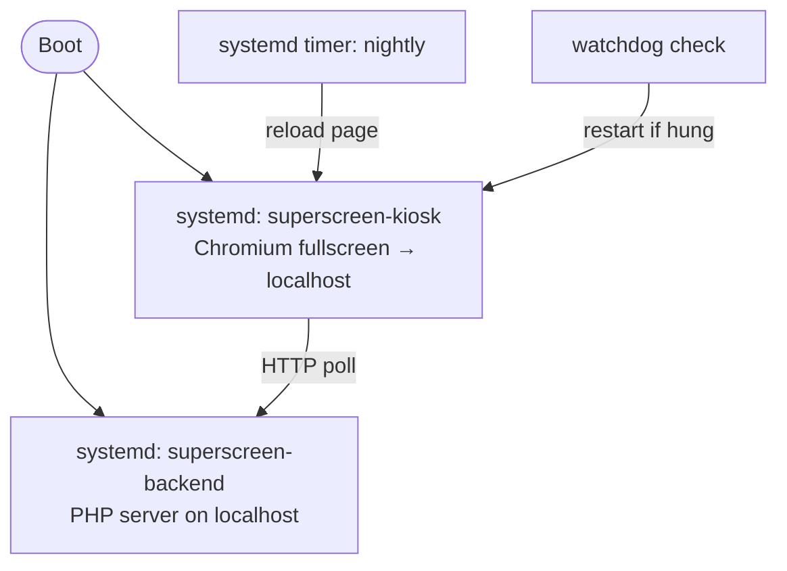

# SuperScreen — Operations & Device Management

How the Raspberry Pi that runs SuperScreen is provisioned, deployed to, kept
running, and monitored. See [`DESIGN.md`](DESIGN.md) for the overview,
[`BACKEND.md`](BACKEND.md) and [`FRONTEND.md`](FRONTEND.md) for the components.

Status: **draft** · Last updated: 2026-06-02

---

## 1. Scope & assumptions

- A **single Pi** drives one TV, with the **backend co-located** on the same
  device (display talks to `http://localhost:<port>/`).
- The Pi lives on a **trusted LAN**. Remote access is over the LAN (see §8);
  a reverse tunnel / off-site access is **out of scope**.
- The box runs **24/7, unattended** — recovery and supervision matter more than
  zero-downtime deploys.

## 2. Runtime processes

Two long-running pieces, both supervised by **systemd** with restart-on-failure
and start-on-boot:

- **`superscreen-backend`** — runs the PHP server (PHP built-in server for
  simplicity, or php-fpm + nginx if a real web server is wanted). `Restart=always`.
- **`superscreen-kiosk`** — launches Chromium in kiosk mode at the local URL,
  after the graphical target. `Restart=always`.

Both being `Restart=always` + enabled at boot means a crash or power cut
self-heals: the box comes back to the live screen with no intervention.

## 3. Provisioning (one-time)

Done once when preparing the SD card / first boot. This is **not** part of the
per-release deploy flow (see §5).

- **Headless first-boot config** (cloud-init `user-data` / `network-config` on the
  boot partition): hostname, a user with SSH, network (Ethernet/DHCP preferred for
  a fixed install), and first-boot package updates.
- **mDNS discovery** (avahi) so the box is reachable as `<hostname>.local` without
  knowing its IP.
- **Packages**: PHP (+ extensions), Chromium, a minimal window manager, and
  `swaybg`/`unclutter`-type helpers for the kiosk.
- **Install systemd units** for `superscreen-backend`, `superscreen-kiosk`, the
  nightly reload timer, and (optionally) a watchdog — then `enable` them.
- **Kiosk hardening** (§4).

Because these change rarely, keep them in a documented provisioning checklist /
script run at setup, separate from application deploys.

## 4. Kiosk hardening

The display must come up fullscreen, stay on, and show nothing but the page:

- **Disable screen blanking / DPMS / screensaver** so the TV never sleeps.
- **Hide the mouse cursor** when idle.
- **Solid black background**; remove desktop panel/wallpaper so there's no flash
  of desktop on boot or reload.
- **Autostart Chromium** in kiosk/fullscreen pointed at the local URL, with flags
  to suppress restore-session and update prompts.
- Set the correct **resolution** and correct any **TV overscan**.

## 5. Deployment — PHP Deployer

Use **[Deployer](https://deployer.org)** for application deploys (backend code +
the static display assets that ship in the repo). Chosen over a custom rsync
script because:

- **Shared files/dirs persist across releases.** `data/` (the layout state file)
  and config live in `shared_dirs`/`shared_files` and are symlinked into each
  release — so a deploy never clobbers the live layout or on-device config.
- **Atomic releases + rollback.** Deploys into `releases/<n>` and flips a
  `current` symlink; a bad deploy is one `dep rollback` away.
- **Composer-aware.** `composer install` is a first-class step.

### Recipe outline
- `deploy:prepare` / `deploy:release` / `deploy:update_code` / `deploy:vendors`
  (standard Deployer flow).
- `shared_dirs`: `data` (state), `config` (or `shared_files` for a single config).
- **Post-deploy hook**: `sudo systemctl restart superscreen-backend`.
- The display is static; a restart of the backend + the kiosk picking up new
  assets on its next nightly reload (or an explicit kiosk restart) is enough.

### What Deployer does NOT handle
OS-level concerns — systemd unit files, kiosk config, installed packages — are
**provisioning** (§3), not deploys. They change rarely and should not ride the
per-release flow. Deployer only restarts the already-installed service.

## 6. Display lifecycle & recovery

- **Nightly reload** via a systemd **timer**: reloads the Chromium page each night
  to counter long-running browser memory growth. Seamless because state is
  server-side, so the screen restores exactly (see [`FRONTEND.md`](FRONTEND.md)).
- **Browser watchdog**: Chromium can hang while the service still looks "active".
  A small healthcheck (page responds / rendered recently?) restarts
  `superscreen-kiosk` on failure — via systemd `WatchdogSec` or a periodic cron
  check.
- **Hardware watchdog**: enable the Pi's `/dev/watchdog` to auto-reboot on a total
  system hang — cheap insurance for an unattended box.
- **Power-loss recovery**: nothing manual. Services auto-start on boot; the
  display re-fetches the layout from the backend on load.

## 7. Monitoring & health

- **Health endpoint / heartbeat**: expose "last layout fetch at T" so you can tell
  the *display is actually polling*, not just that the Pi is powered on — that's
  the failure mode most worth catching.
- **Error tracking**: wire the backend (and optionally client-side JS errors) to
  an error tracker so you see production problems without SSH-and-grep.
- **Logs**: rely on `journalctl` for the systemd services; keep disk writes modest
  to protect the SD card.

## 8. Remote access (LAN)

- Reach the box over the LAN as `<hostname>.local` (mDNS) and manage it via SSH.
- No inbound exposure beyond the LAN; no reverse tunnel.
- If the device ever moves off-LAN to a site behind NAT, remote access would need
  revisiting — explicitly out of scope here.

## 9. Open questions

- PHP server choice: built-in server (simplest) vs. php-fpm + nginx (more robust)?
- Watchdog mechanism: systemd `WatchdogSec` vs. an external cron healthcheck?
- Which error-tracking / monitoring target, if any, for v1?
- Provisioning as a documented checklist vs. a scripted/automated image build?
