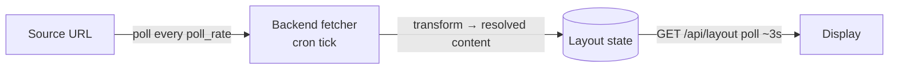

# SuperScreen — Pull-Sourced Tiles (OPTIONAL / FUTURE)

> **Status: OPTIONAL — not part of the MVP.** This describes an additive,
> later-phase capability. The core system is push-based (callers POST tile
> content); see [`DESIGN.md`](DESIGN.md), [`BACKEND.md`](BACKEND.md), and
> [`FRONTEND.md`](FRONTEND.md). Build and ship push first.

Last updated: 2026-06-02

---

## 1. Idea

Instead of an external system repeatedly **pushing** a tile's content, you
register a tile once with a **source URL** and a poll rate. The backend polls
that URL periodically, transforms the response into tile content, and stores it.

Pull is best understood as an **optional server-side content provider** that
resolves into the *same* tile model the display already renders. It does **not**
introduce a second display mode and does **not** change the frontend or the
layout contract.

## 2. When it's actually needed

Part of "pull" already exists for free: for `image`, `video`, and `iframe`, the
**browser** fetches the URL on every render, so a self-refreshing embedded page
already updates itself. Server-side pull earns its keep only where client
embedding fails or isn't enough:

- **Non-embeddable sources** — the page sends `X-Frame-Options`/CSP and refuses
  to load in an iframe; the server fetches and re-serves/transforms it.
- **Raw data APIs** — the source returns JSON to be rendered as `text`/`image`,
  not shown raw; the server maps data → tile content.
- **Secret-bearing sources** — the source needs an API key. The server holds the
  secret; the display (and anyone viewing it) never sees it.
- **Shielding third parties / CORS** — one server fetch feeds the screen
  regardless of reloads, instead of the browser hammering the source.
- **"Set and forget" dashboards** — register a URL once and it self-updates
  (weather, build status, departure boards), with nothing having to keep pushing.

If a source is directly embeddable and self-refreshing, prefer a plain `iframe`
push tile — no pull needed.

## 3. How it fits

A tile gains an optional `source` as an alternative to static `content`:

```json
{
  "id": "weather",
  "source": { "url": "https://api.example.com/weather", "poll_rate": 300, "type": "..." },
  "position": { "x": 0, "y": 0, "w": 2, "h": 1 }
}
```

- `source.url` — what the backend fetches.
- `source.poll_rate` — seconds between fetches.
- `source.type` — how to interpret/transform the response into content.

The backend polls the source, transforms the response into **resolved
`content`**, and stores it on the tile. The display's normal `GET /api/layout`
returns that resolved content, so **the frontend is unchanged** — ETag/304 and
keyed reconciliation already refresh it smoothly.



## 4. The main cost: a scheduler

Today the backend is plain request/response PHP with no background work.
Server-side polling needs a **scheduler**, which is the principal trade-off:

- **Cron tick (recommended start).** A `cron` job runs every minute, finds tiles
  whose `poll_rate` is due (via a `last_fetched` timestamp), and refreshes them.
  Poll granularity is then bounded to ~1 minute — fine for most dashboards, and
  it keeps the "no long-running process" property.
- **Daemon.** Needed only for sub-minute rates or many tiles. More capable, but
  now a supervised process runs on the Pi.

Start with the cron tick.

## 5. Obstacles to plan for

- **SSRF — the important one.** A server fetching arbitrary URLs can be aimed at
  the internal network or cloud metadata endpoints. If the write API is open this
  is a real risk. Mitigate with a **host/scheme allowlist**, block private IP
  ranges, and enforce timeouts. Treat this as mandatory, not optional, if pull is
  built.
- **Failure handling.** Source down/slow: keep the last good content, never blank
  the tile, optionally mark it stale — same resilience philosophy as the display.
- **Transformation.** How raw responses become tile content. Easiest when the
  source returns ready-to-use HTML/image; harder for JSON→template mapping. Keep
  the v1 mapping deliberately simple (e.g. `html`/`image` pass-through only).
- **Resource use.** Cap concurrent fetches and enforce timeouts on the Pi.

## 6. Recommendation

Add this **after** the push MVP works, scoped tightly:

1. Pull-sourced tiles that resolve into the existing content model.
2. Driven by a cron tick (~1 min granularity).
3. SSRF allowlist from day one.
4. Simple pass-through transforms first; richer mapping later.

It composes cleanly precisely because it doesn't touch the display or the layout
contract — it only adds a content provider behind the same state.

## 7. Open questions (pull-specific)

- Transform model: pass-through only, or a templating step for JSON sources?
- Allowlist management: static config, or API-managed?
- Should `poll_rate` have a minimum floor to protect sources and the Pi?
- Stale-content policy: how long is "last good" content shown before it's
  flagged or dropped?
