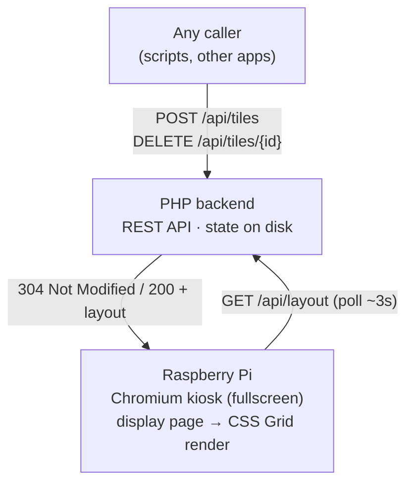

# SuperScreen — Design Overview

API-driven grid display for a TV, running on a Raspberry Pi.

Status: **draft** · Last updated: 2026-06-02

This is the high-level overview. Component detail lives in dedicated docs:

- [`BACKEND.md`](BACKEND.md) — API, state, TTL, change detection (PHP).
- [`FRONTEND.md`](FRONTEND.md) — the display page (Chromium kiosk + CSS Grid).
- [`OPERATIONS.md`](OPERATIONS.md) — provisioning, deploy, supervision, monitoring (Pi).
- [`PULL-SOURCED-TILES.md`](PULL-SOURCED-TILES.md) — **optional/future**: server-side polling of source URLs.

---

## 1. Goal

A screen permanently mounted on a TV that shows a configurable **grid** of content
tiles. The layout is controlled remotely through an **HTTP API**: callers push
content with a named size and a duration (or permanent); the backend places it on
the grid. The screen reflects changes within a few seconds.

## 2. Scope & assumptions

These decisions are settled and shape the whole design:

- **One screen.** No multi-device support. A single, global layout state.
- **A few seconds of delay is acceptable.** The display **polls** the API; no
  real-time push (no WebSocket).
- **Runs on a Raspberry Pi** (Pi 4 / 5 recommended) driving a TV over HDMI.
- **Backend in PHP.** Framework/system chosen later.
- The API is trusted/LAN-side by default; optional shared-secret auth for writes.

Out of scope for now: multiple screens, user accounts, a management UI,
scheduling/playlists. The data model leaves room to add these later.

## 3. Architecture

The Pi and the backend can run on the **same device** (the Pi serves its own API)
or the backend can live elsewhere on the network. Same-device is simplest and is
the recommended starting point.

### Why a web display
A fullscreen browser renders text, images, video, web pages, fonts, and
animations for free, and **CSS Grid** maps directly onto the tile model
(`grid-column` / `grid-row` with spans). A native app would cost far more for no
real benefit here.

### Why polling (not WebSocket)
Because a few seconds of delay is fine and there is only one screen, polling is
simpler and more robust: no persistent connections, trivial recovery after a
network blip or reboot, and a plain PHP backend with no long-running process.

### One snapshot, per-tile lifetimes
The display fetches the **whole layout in one call** rather than checking tiles
individually. Per-tile durations are still fully supported — TTL is enforced
**server-side** (each tile carries its own expiry; expired tiles are simply left
out of the snapshot). A single snapshot keeps the screen atomically consistent,
needs only one request per poll, and pairs with the frontend's keyed
reconciliation so unrelated tiles aren't disturbed when one expires. Per-tile
polling would add N× requests and inconsistent frames for no benefit at this
scale.

## 4. Domain model

A **tile** is the unit of content placed on the grid. There are **two
representations**: the API-facing model that callers send, and the internal model
the backend stores and the display renders. The backend translates between them.

### 4.1 API-facing tile (what callers POST)

The write API is deliberately minimal. Callers pick a content payload and a
**named size** — they do **not** specify pixel/grid coordinates. The backend
owns placement.

| Field      | Type                                | Notes                                                        |
|------------|-------------------------------------|--------------------------------------------------------------|
| `id`       | string \| null                      | Optional stable key. Re-posting the same id replaces it (upsert). When omitted/empty the backend generates one (truncated SHA-256 hex) and returns it. |
| `content`  | object                              | `{ "type": ..., ... }` — see content types below.           |
| `size`     | enum `small` \| `medium` \| `large` \| `xlarge` | A pre-split footprint (see below). **Mutually exclusive with `width`/`height`.** |
| `width`/`height` | int                           | An explicit footprint in cells, instead of `size`. Both required together; `width × height ≤ 9`. |
| `duration` | int \| null                         | Seconds the tile stays live. `null` = permanent.            |

A request must carry **exactly one** of: a `size`, or both `width` and `height`.

#### Size presets
Footprint is expressed as **width × height** in grid cells:

| `size`   | Footprint (w × h) |
|----------|-------------------|
| `small`  | 1 × 1             |
| `medium` | 2 × 1             |
| `large`  | 2 × 2             |
| `xlarge` | 3 × 3             |

The named presets keep callers simple and let
the backend control the visual grammar of the screen. Position (`x`, `y`) is
**not** caller-controlled — the backend places the tile (placement strategy is an
open question, see §8).

### 4.2 Internal tile (stored & rendered)

Internally the system keeps the full, explicit model — unchanged from before. The
backend resolves `size` → `w`, `h` and assigns `x`, `y` when it places the tile.
The display consumes this model via `GET /api/layout`, so the **frontend is
unaffected** by the API-facing simplification.

| Field        | Type                | Notes                                                        |
|--------------|---------------------|--------------------------------------------------------------|
| `id`         | string              | As supplied.                                                 |
| `content`    | object              | As supplied.                                                 |
| `position`   | object              | `{ "x", "y", "w", "h" }` in grid cells (0-indexed origin). `w`/`h` derived from `size`; `x`/`y` assigned by placement. |
| `expires_at` | int \| null         | **Computed server-side** = `now + duration`. Not sent by callers. |
| `created_at` | int                 | Server timestamp.                                            |

### Content types
| `type`   | Payload fields        | Rendering                                  |
|----------|-----------------------|--------------------------------------------|
| `text`   | `text`, optional style | Text in a cell.                            |
| `image`  | `src`                 | Image, scaled to cover the cell.           |
| `video`  | `src`                 | Muted autoplay loop (browsers block sound).|
| `iframe` | `src`                 | Embedded web page (see CSP caveat below).  |
| `html`   | `html`                | Raw HTML (trusted callers only — XSS risk).|

## 5. Deployment / Raspberry Pi (operational)

- **Chromium in kiosk mode**, auto-started on boot.
- Disable screen blanking / screensaver.
- Quality SD card or boot from SSD/USB; keep disk writes (logs) low to avoid
  SD wear.
- Configure resolution; correct any TV overscan.
- Optional **HDMI-CEC** to power the TV on/off on a schedule.
- Recommended hardware: **Pi 4 / 5** (4GB+); a Pi 3 struggles with video.

## 6. Cross-cutting risks

| Risk | Mitigation | Owner doc |
|------|------------|-----------|
| Power loss / reboot | Auto-start kiosk; display re-fetches layout on load (state is server-side). | both |
| SD card wear | Good card or SSD; minimal logging. | deployment |
| Open API on the network | Optional `X-Api-Key` for writes; serve over HTTPS / keep LAN-only. | backend |
| OLED burn-in (static content) | Minor for typical TVs; optional pixel-shift if needed. | frontend |

Component-specific risks are listed in `BACKEND.md` and `FRONTEND.md`.

## 7. Tech stack summary

| Layer    | Choice                                             |
|----------|----------------------------------------------------|
| Display  | Chromium kiosk + HTML/CSS Grid/JS (vanilla, no build) |
| Transport| HTTP polling with ETag/304                         |
| Backend  | PHP (framework/system TBD)                          |
| Storage  | Single atomic JSON file                            |
| Host     | Raspberry Pi 4/5, backend co-located by default    |

## 8. Open questions

- **Placement strategy** *(decided)*: callers send only a `size`; the backend
  assigns `x`/`y` by **first-fit** (top-to-bottom, left-to-right). **No room →
  queue**: the tile is held and placed automatically (greedy, FIFO) when space
  frees via expiry or deletion; its TTL starts when it's placed. A tile larger
  than the whole grid is rejected (409).
- **Default/empty cells:** show nothing, a background, or a fallback tile?
- **Transitions:** any fade/animation when a tile appears or expires?
- **Grid reconfiguration:** is the grid size fixed in config, or also API-driven?
- **Content sourcing:** who calls the API (manual scripts, cron, other systems)?
- **Backend location:** on the Pi itself, or a separate server?

These don't block the design but should be decided before/while building.

## 9. Next steps

1. Resolve the open questions above (at least overlap + empty-cell behaviour).
2. Choose the PHP framework/system for the backend.
3. Build backend and frontend skeletons.
4. Test on target Pi hardware with real content types (especially video + iframes).
5. Harden: auto-start, nightly reload, optional auth.
